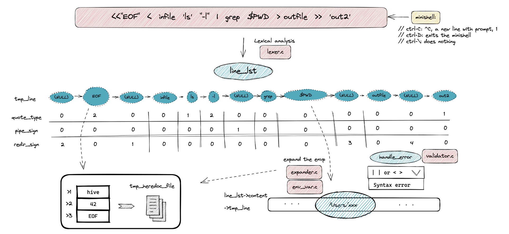
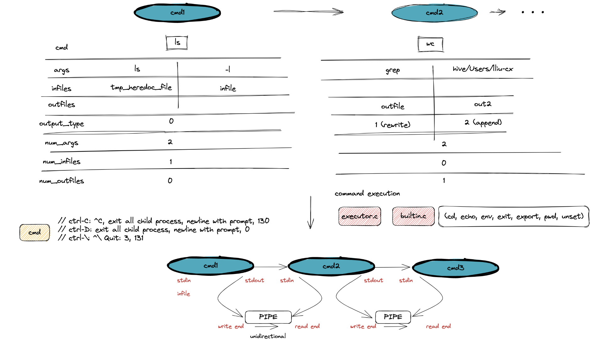

# 
Minishell - as beautiful as a shell

## Description

Minishell is a shell programme written in C.

<bt>

## Language used

<bt>

## Functionality

It minics the behavior of bash:

- Display a prompt when waiting for a new command.
- Implement pipes and redirections.
- Search and launch the right executable based on the PATH variable or using a relative or an absolute path.
- Handle both single and double quotes.
- Handle $? which should expand to the exit status of the most recently executed foreground pipeline.
- Handle ctrl-C, ctrl-D and ctrl-\ which should behave like in bash.

<bt>
	In interactive mode:

		- ctrl-C displays a new prompt on a new line.
		- ctrl-D exits the shell.
		- ctrl-\ does nothing.

<bt>
	It implements the following builtins:

		- echo with option -n
		- cd with only a relative or absolute path ◦ pwd with no options
		- export with no options
		- unset with no options
		- env with no options or arguments
		- exit with no options

## Work flow

**1- lexer && parser :**

**2- build a command table :**

**3- Connect pipe :**

 

## Usage
**1- To compile the programme:**

    Make

**2- Run your program with arguments:**

	./minishell

## Example

## Testing

*External testers:*

+ [minishell_tester by LucasKuhn](https://github.com/LucasKuhn/minishell_tester.git)
